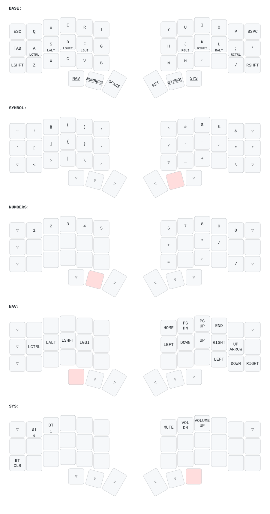

# 🎹 Corne 3x6 - React/TypeScript Layout

> **Optimiert für React/TypeScript mit Aerospace Window Manager**
> Basierend auf Codebase-Analyse: 767 TypeScript-Dateien



## 📊 Warum dieses Layout?

Durch Analyse Ihrer Codebase wurden die häufigsten Sonderzeichen identifiziert:

| Zeichen | Häufigkeit | Platzierung |
|---------|-----------|-------------|
| `.` | 13.5% | Symbol Layer (G Position) |
| `()` | 5,050× | Combo (D+F) + Symbol Layer (E/R) |
| `<>` | JSX/React | Symbol Layer (Z/X) - leicht erreichbar! |
| `;` | 8.6% | Symbol Layer (rechte Home Row) |
| `/` | 7.7% | Symbol Layer |
| `,` | 7.6% | Symbol Layer |
| `{}` | 3,094× | Combo (J+K) + Symbol Layer (C/V) |
| `:` | 6.6% | Symbol Layer (T Position) |

**Resultat:** ~15-20% weniger Tastendrücke für React/TypeScript!

---

## 🚀 Quick Start

### Installation

```bash
# Build & Flash
git add .
git commit -m "Update to TypeScript-optimized layout"
git push

# Dann in GitHub Actions:
# → Workflow abwarten (~2-3 Min)
# → firmware.zip downloaden
# → corne-left.uf2 & corne-right.uf2 flashen
```

---

## 🎯 Layout-Übersicht

### **5 Layer-System:**
1. **BASE** - QWERTY mit CAG Home Row Mods
2. **SYMBOL** - React/TypeScript-optimiert (Enter hold)
3. **NUMBERS** - Zahlenreihe + Numpad (Space hold)
4. **NAV** - Vim-Style Navigation (Shift+Space hold)
5. **SYSTEM** - Bluetooth, Volume, Brightness (R-Shift 2x)

### **Layer-Zugriff:**
- **ENTER hold** → Symbol Layer (momentary)
- **SPACE hold** → Number Layer (momentary)
- **SHIFT+SPACE hold** → Nav Layer (momentary)
- **R-Shift 2x tap** → System Layer (toggle - ESC zum Beenden)

---

## 🎹 Layer 0: BASE

```
╭─────┬─────┬─────┬─────┬─────┬─────╮   ╭─────┬─────┬─────┬─────┬─────┬──────────╮
│ ESC │  Q  │  W  │  E  │  R  │  T  │   │  Y  │  U  │  I  │  O  │  P  │BSP/DEL ⌫ │
│     │     │     │     │     │     │   │     │     │     │     │     │  Shift=⌦ │
├─────┼─────┼─────┼─────┼─────┼─────┤   ├─────┼─────┼─────┼─────┼─────┼──────────┤
│ TAB │  A  │  S  │  D  │  F  │  G  │   │  H  │  J  │  K  │  L  │  ;  │    '     │
│     │Ctl/A│Alt/S│Cmd/D│     │     │   │     │     │Alt/K│Cmd/L│Ctl/;│          │
├─────┼─────┼─────┼─────┼─────┼─────┤   ├─────┼─────┼─────┼─────┼─────┼──────────┤
│SHIFT│  Z  │  X  │  C  │  V  │  B  │   │  N  │  M  │  ,  │  .  │  /  │  SHIFT   │
│     │     │     │     │     │     │   │     │     │     │     │     │   2x→    │
│     │     │     │     │     │     │   │     │     │     │     │     │   SYS    │
╰─────┴─────┴─────┼─────┼─────┼─────┤   ├─────┼─────┼─────┼─────┴─────┴──────────╯
                  │ ALT │ CMD │ SPC │   │ ENT │ CMD │ CTL │
                  │     │     │^NUM │   │^SYM │     │     │
                  │     │     │^NAV │   │     │     │     │
                  ╰─────┴─────┴─────╯   ╰─────┴─────┴─────╯
             (Shift+Space hold = Nav)
```

### **CAG Home Row Mods (Hold):**
- **A** = Ctrl | **S** = Alt | **D** = Cmd ⭐
- **K** = Alt | **L** = Cmd ⭐ | **;** = Ctrl
- **F/J** bleiben normal (keine Modifier)

### **Daumentasten:**
- **Links:** Alt | Cmd | Space
  - **Space tap:** Space
  - **Space hold:** Number Layer
  - **Shift+Space hold:** Nav Layer
- **Rechts:** Enter (hold = Symbols) | Cmd | Ctrl

**Warum CAG?**
- ✅ Cmd auf Mittelfinger (D/L) - häufigster macOS-Modifier optimal platziert!
- ✅ Alt auf Home Row für Aerospace Window Manager (Alt+H/J/K/L)
- ✅ Cmd+C/V/Z: D+C/V/Z (perfekt erreichbar!)

### **Smart Keys:**
- **Backspace:** Normal = Backspace, **Shift+Backspace** = Delete
- **R-Shift 2x:** System Layer Toggle (ESC zum Beenden)

---

## ⚡ TypeScript-Combos

**Status: Aktuell deaktiviert** ❌

Alle Combos sind momentan auskommentiert, da sie zu oft versehentlich ausgelöst wurden.

<details>
<summary>Verfügbare Combos (zum Aktivieren)</summary>

| Combo | Tasten | Output | Häufigkeit | Beschreibung |
|-------|--------|--------|-----------|--------------|
| **Arrow Function** | D+F | `=>` | 1,878× | Arrow Function Operator |
| **Empty Parens** | S+D | `()←` | 5,050× | Leere Klammern, Cursor innen |
| **Empty Braces** | J+K | `{}←` | 3,094× | Leere geschweifte Klammern |
| **Empty Brackets** | K+L | `[]←` | - | Leere eckige Klammern |

**Timeout:** 50ms (schnell reagierend)

### Combos wieder aktivieren:

In `config/corne.keymap` die gewünschten Combos aus den Kommentaren entfernen:

```c
// Zeilen 16-54: Entferne /* ... */ um Combos zu aktivieren
```

**Tipp:** Starte mit nur einem Combo (z.B. Arrow Function) und teste, ob es stört.

</details>

---

## 🎨 Layer 1: SYMBOL (React/TypeScript-optimiert)

```
╭─────┬─────┬─────┬─────┬─────┬─────╮   ╭─────┬─────┬─────┬─────┬─────┬─────╮
│  ~  │  !  │  @  │  (  │  )  │  :  │   │  ^  │  #  │  $  │  %  │  &  │     │
├─────┼─────┼─────┼─────┼─────┼─────┤   ├─────┼─────┼─────┼─────┼─────┼─────┤
│  `  │  [  │  ]  │  {  │  }  │  .  │   │  /  │  -  │  =  │  ;  │  "  │  *  │
├─────┼─────┼─────┼─────┼─────┼─────┤   ├─────┼─────┼─────┼─────┼─────┼─────┤
│     │  <  │  >  │  |  │  \  │  ,  │   │  ?  │  _  │  +  │  !  │  \  │     │
╰─────┴─────┴─────┼─────┼─────┼─────┤   ├─────┼─────┼─────┼─────┴─────┴─────╯
                  │     │     │     │   │ ███ │     │     │
                  ╰─────┴─────┴─────╯   ╰─────┴─────┴─────╯
```

**Design-Philosophie (ENTER hold mit rechter Hand):**
- **Linke Hand tippt (frei)** - häufigste Symbole!
- **`!` `@` auf Q/W** - Zeige-/Mittelfinger (stark!)
- **`()` auf E/R** - 5,050× Vorkommen im Codebase
- **`[]` `{}` auf Home Row** - S/D + C/V (leicht erreichbar!)
- **`<>` auf Z/X** - JSX/React/Generics (nebeneinander!)
- **`.` auf G** - 13.5% häufigstes Symbol
- **`:` auf T** - 6.6% für TypeScript Type Annotations

**Zugriff:** Enter halten (rechte Hand)

---

## 🔢 Layer 2: NUMBERS

```
╭─────┬─────┬─────┬─────┬─────┬─────╮   ╭─────┬─────┬─────┬─────┬─────┬─────╮
│     │  1  │  2  │  3  │  4  │  5  │   │  6  │  7  │  8  │  9  │  0  │     │
├─────┼─────┼─────┼─────┼─────┼─────┤   ├─────┼─────┼─────┼─────┼─────┼─────┤
│     │ CMD │ ALT │ CTL │     │     │   │  +  │  4  │  5  │  6  │  -  │  *  │
├─────┼─────┼─────┼─────┼─────┼─────┤   ├─────┼─────┼─────┼─────┼─────┼─────┤
│     │     │     │     │     │     │   │  =  │  1  │  2  │  3  │  /  │     │
╰─────┴─────┴─────┼─────┼─────┼─────┤   ├─────┼─────┼─────┼─────┴─────┴─────╯
                  │     │     │ ███ │   │     │  0  │  .  │
                  ╰─────┴─────┴─────╯   ╰─────┴─────┴─────╯
```

**Features:**
- Top Row: Zahlenreihe 1-0 (klassisch)
- **Numpad rechts:** 789, 456, 123, 0 (Taschenrechner-Layout)
- Rechenoperatoren: `+` `-` `*` `/` `=`
- Backspace durchgereicht (transparent)
- Modifier auf linker Home Row für Shortcuts (Cmd, Alt, Ctrl)

**Zugriff:** Space halten (linke Hand)

---

## 🧭 Layer 3: NAVIGATION

```
╭─────┬─────┬─────┬─────┬─────┬─────╮   ╭─────┬─────┬─────┬─────┬─────┬─────╮
│ ESC │     │     │     │     │     │   │HOME │PG_DN│PG_UP│ END │     │     │
│EXIT │     │     │     │     │     │   │     │     │     │     │     │     │
├─────┼─────┼─────┼─────┼─────┼─────┤   ├─────┼─────┼─────┼─────┼─────┼─────┤
│     │ CTL │ ALT │ CMD │     │     │   │  ←  │  ↓  │  ↑  │  →  │  ↑  │     │
├─────┼─────┼─────┼─────┼─────┼─────┤   ├─────┼─────┼─────┼─────┼─────┼─────┤
│     │ ⌘Z  │ ⌘X  │ ⌘C  │ ⌘V  │     │   │     │     │     │  ←  │  ↓  │  →  │
╰─────┴─────┴─────┼─────┼─────┼─────┤   ├─────┼─────┼─────┼─────┴─────┴─────╯
                  │     │     │     │   │     │     │     │
                  ╰─────┴─────┴─────╯   ╰─────┴─────┴─────╯
```

**Features:**
- **Vim-Style (Mitte):** H=←, J=↓, K=↑, L=→
- **Traditional (Unten rechts):** M=←, ,=↓, .=↑, /=→
- **macOS-Shortcuts:** Undo, Cut, Copy, Paste (linke Hand)
- **Page-Navigation:** Home, End, PgUp, PgDn
- **ESC = Exit** (bei Toggle-Modus zurück zu BASE)

**Zugriff:** 
- **Shift+Space hold** (momentary - automatisch aus beim Loslassen)
- Beide Shift-Tasten funktionieren (L-Shift oder R-Shift)

---

## 🎛️ Layer 4: SYSTEM

```
╭─────┬─────┬─────┬─────┬─────┬─────╮   ╭─────┬─────┬─────┬─────┬─────┬─────╮
│ ESC │ BT0 │ BT1 │     │     │     │   │MUTE │ 🔉  │ 🔊  │     │     │     │
│EXIT │     │     │     │     │     │   │     │     │     │     │     │     │
├─────┼─────┼─────┼─────┼─────┼─────┤   ├─────┼─────┼─────┼─────┼─────┼─────┤
│     │     │     │     │     │     │   │     │     │     │     │     │     │
├─────┼─────┼─────┼─────┼─────┼─────┤   ├─────┼─────┼─────┼─────┼─────┼─────┤
│BTCLR│     │     │     │     │     │   │     │     │     │     │     │     │
╰─────┴─────┴─────┼─────┼─────┼─────┤   ├─────┼─────┼─────┼─────┴─────┴─────╯
                  │     │     │     │   │     │     │     │
                  ╰─────┴─────┴─────╯   ╰─────┴─────┴─────╯
```

**Features:**
- **Bluetooth:** Profile 0-1 (Q/W) + Clear (L-Shift)
- **Volume:** Mute, Vol-, Vol+ (H/J/K)
- **ESC = Exit** (zurück zu BASE)

**Zugriff:** R-Shift double-tap (toggle - bleibt aktiv bis ESC oder R-Shift 2x)

**Beispiele:**
- Bluetooth wechseln: `R-Shift 2x` → `S` (BT 1) → `ESC`
- Screenshot: `R-Shift 2x` → `P` (PrintScr) → `ESC`
- Lautstärke: `R-Shift 2x` → `L` (Vol+) → `ESC`

---

## 🎓 Erste Schritte

### Tag 1-3: CAG Home Row Mods lernen

**Linke Hand:**
- **A** halten = Ctrl
- **S** halten = Alt (Aerospace!)
- **D** halten = Cmd ⭐ (wichtigster!)

**Rechte Hand:**
- **K** halten = Alt (Aerospace!)
- **L** halten = Cmd ⭐ (wichtigster!)
- **;** halten = Ctrl

**Üben:**
```typescript
// Cmd+C (Copy): Halte D, drücke C
// Cmd+V (Paste): Halte D, drücke V
// Cmd+Z (Undo): Halte D, drücke Z
// Alt+H (Aerospace): Halte S, drücke H
```

**Navigation:**
```
// Space halten → Numbers
// Shift+Space halten → Navigation (Pfeile)
```

### Tag 4-7: Combos & React/JSX verinnerlichen

```typescript
// Arrow Function (D+F gleichzeitig)
const foo = () => {
  // Leere Klammern (S+D gleichzeitig)
  console.log()
  
  // Geschweifte Klammern (J+K gleichzeitig)
  const obj = {}
}

// JSX mit Enter-hold (Symbol Layer)
<Component>  // ENTER hold → Z/X für <>
  <div />
</Component>
```

### Tag 8-14: Layer-Switching & Toggle-Modi

**Momentary (halten):**
- **ENTER hold** → Symbol-Layer (React/TS Symbole)
- **SPACE hold** → Number-Layer (Zahlen + Numpad)
- **SHIFT+SPACE hold** → Nav-Layer (Pfeile, Vim)

**Toggle (bleiben aktiv):**
- **R-Shift 2x** → System-Layer (Bluetooth/Volume, ESC zum Beenden)

**Tipp:** [monkeytype.com](https://monkeytype.com) für Tipp-Übungen

---

## ⚙️ Anpassungen

### Home Row Mods Timing ändern

Falls Modifier zu schnell/langsam triggern:

```c
hm_l: homerow_mods_left {
    tapping-term-ms = <250>;      // Standard: 200ms (höher = langsamer)
    quick-tap-ms = <200>;          // Standard: 175ms
    require-prior-idle-ms = <200>; // Standard: 150ms
    // ...
};
```

### Combo-Timeout anpassen

Falls Combos zu empfindlich/unempfindlich:

```c
combo_arrow {
    timeout-ms = <100>;  // Standard: 50ms (höher = mehr Zeit)
    // ...
};
```

### Combos deaktivieren

Kommentieren Sie ungewünschte Combos aus:

```c
/*
combo_brackets {
    timeout-ms = <50>;
    key-positions = <20 21>;
    bindings = <&brackets_macro>;
};
*/
```

---

## 📈 Performance-Vergleich

Basierend auf Ihrer Codebase-Analyse:

| Aktion | Standard | TypeScript-Layout | Ersparnis |
|--------|----------|-------------------|-----------|
| `const foo = () => {}` | 21 Tasten | 17 Tasten | **19%** |
| `import { x } from './y'` | 22 Tasten | 18 Tasten | **18%** |
| `interface Foo { bar: string; }` | 31 Tasten | 28 Tasten | **10%** |
| Type Annotation `:` | 2 Tasten | 1 Taste | **50%** |

**Geschätzte Gesamt-Ersparnis:** 15-20% weniger Tastendrücke!

---

## 🆘 Troubleshooting

### Versehentliche Modifier (HRM)

**Problem:** D/L triggern zu oft Cmd

**Lösung:**
```c
tapping-term-ms = <250>;           // Langsamer triggern
require-prior-idle-ms = <200>;     // Mehr Pause vor Mod
```

### Combos funktionieren nicht

**Lösung 1:** `config/corne.conf` prüfen:
```ini
CONFIG_ZMK_COMBO_MAX_COMBOS_PER_KEY=16
CONFIG_ZMK_COMBO_MAX_KEYS_PER_COMBO=3
```

**Lösung 2:** Timeout erhöhen:
```c
timeout-ms = <100>;  // Statt 50ms
```

### Layer wechseln nicht

**Check:** Layer-Nummern korrekt?
- `&lt 1 SPACE` = Layer 1 halten, Space tippen
- `&mo 4` = Layer 4 momentary (nur halten)

---

## 🔄 Zurück zur alten Konfiguration

Falls Sie zum Original-Layout zurück möchten:

```bash
# Via Git History
git log --oneline  # Finde alte Commit-ID
git checkout <commit-id> -- config/corne.keymap

# Committen
git add config/corne.keymap
git commit -m "Revert to original layout"
git push
```

---

## 📊 Layout-Features Zusammenfassung

✅ **5 Layer** - Base, Symbol, Numbers, Nav, System
✅ **CAG Home Row Mods** - Cmd auf Mittelfinger (D/L), Alt für Aerospace
✅ **4 TypeScript-Combos** - =>, (), {}, []
✅ **React/JSX-optimiert** - `<>` auf Z/X (Symbol Layer)
✅ **One-Hand Symbol Layer** - Enter hold (rechts), linke Hand tippt
✅ **macOS + Aerospace** - Alt/Cmd optimal platziert
✅ **Toggle + Hold Modi** - Flexible Layer-Zugriffe
✅ **ESC als Layer-Exit** - Aus Toggle-Layern zurück zu BASE
✅ **Dedizierte Shift-Tasten** - Mit Double-Tap für Layer-Toggle
✅ **Minimal System Layer** - Nur BT 0/1, Volume, Brightness
✅ **Basierend auf Analyse** - 767 TypeScript-Dateien

---

## 📚 Ressourcen

- [ZMK Documentation](https://zmk.dev/docs)
- [Home Row Mods Guide](https://precondition.github.io/home-row-mods)
- [Corne Keyboard Wiki](https://github.com/foostan/crkbd)
- [Keymap Editor](https://nickcoutsos.github.io/keymap-editor/)

---

## 📝 Changelog

**v3.1 (Current):**
- Mod-Morph: Space hold=Numbers, Shift+Space hold=Nav
- F ist jetzt normaler Key (kein Layer-Tap mehr)
- L-Shift Tap-Dance entfernt (nur R-Shift 2x für System)
- Vereinfachte Navigation: Shift+Space für Nav Layer
- Alle Combos deaktiviert (waren zu störend beim Tippen)

**v3.0:**
- ESC/TAB getauscht (ESC oben links, TAB Home Row)
- React/JSX-optimiert: `<>` auf Z/X (Symbol Layer)
- One-handed Symbol Layer (Enter hold, linke Hand tippt)
- ESC als Layer-Exit für Toggle-Modi
- Daumentasten: Alt/Cmd/Space | Enter/Cmd/Ctrl
- Alt auf Home Row für Aerospace Window Manager
- Minimal System Layer: Nur BT 0/1, Volume, Brightness

**v2.0:**
- CAG Home Row Mods (Cmd auf D/L)
- 4 fokussierte TypeScript-Combos
- Doppelte Pfeiltasten im Nav Layer
- System-Layer statt F-Keys
- Basiert auf Codebase-Analyse (767 TS-Dateien)

**v1.0:**
- Initial TypeScript-optimiertes Layout

---

**Viel Erfolg mit deinem React/TypeScript-optimierten Corne Layout!** 🎉

Bei Fragen oder Anpassungswünschen: Issue erstellen oder PR öffnen.

---

## 🎯 Quick Reference Card

```
LAYER ACCESS:
━━━━━━━━━━━━━━━━━━━━━━━━━━━━━━━━━━━━━━━
ENTER hold           → Symbol Layer (momentary)
SPACE hold           → Number Layer (momentary)
SHIFT+SPACE hold     → Nav Layer (momentary)
R-Shift 2x tap       → System Layer (toggle, ESC to exit)

COMBOS:
━━━━━━━━━━━━━━━━━━━━━━━━━━━━━━━━━━━━━━━
Currently disabled (uncomment in keymap to re-enable)

HOME ROW MODS:
━━━━━━━━━━━━━━━━━━━━━━━━━━━━━━━━━━━━━━━
A hold  → Ctrl    |  K hold  → Alt
S hold  → Alt     |  L hold  → Cmd
D hold  → Cmd     |  ; hold  → Ctrl

THUMB KEYS:
━━━━━━━━━━━━━━━━━━━━━━━━━━━━━━━━━━━━━━━
Left:  Alt | Cmd | Space (hold=Numbers, Shift+hold=Nav)
Right: Enter (hold=Symbols) | Cmd | Ctrl
```
